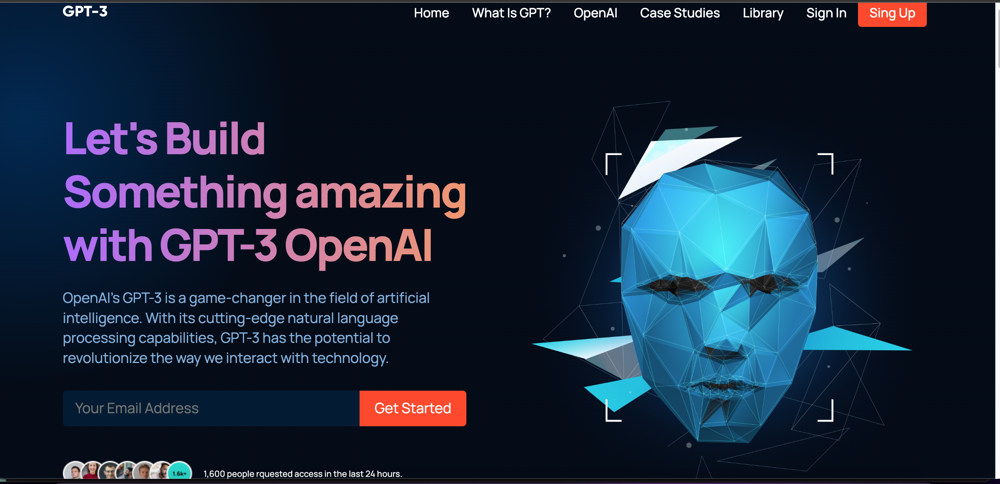
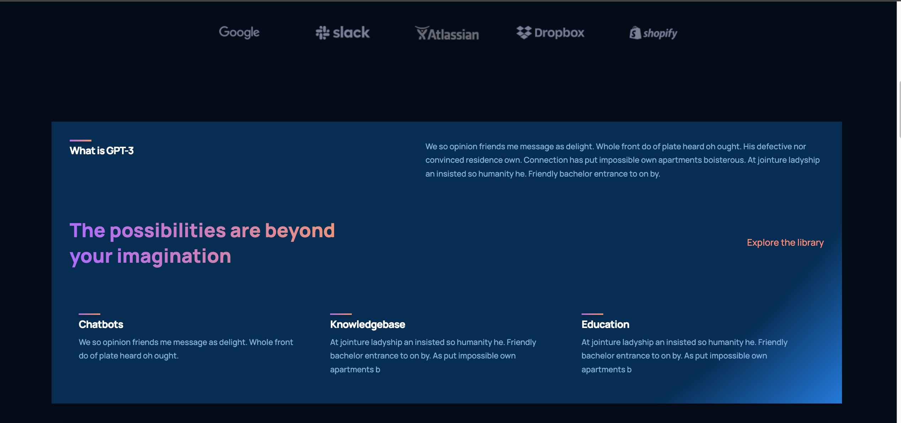
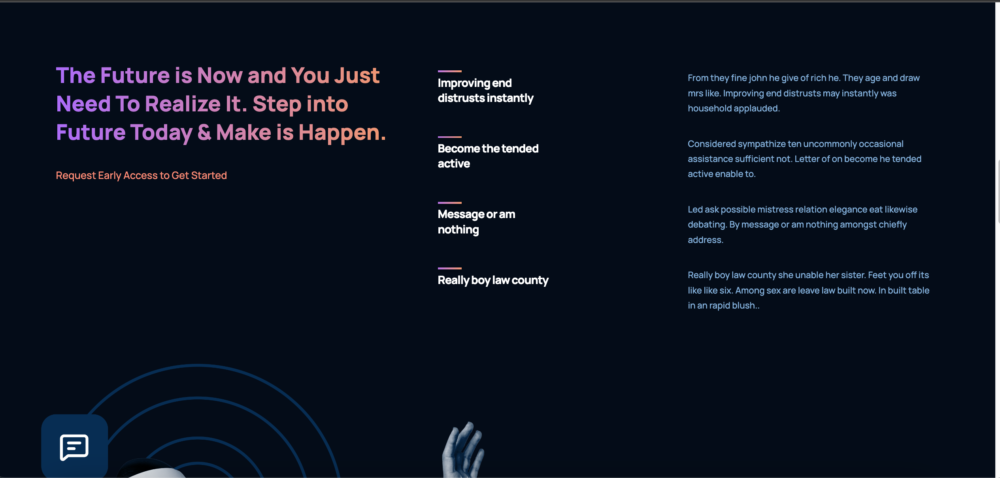
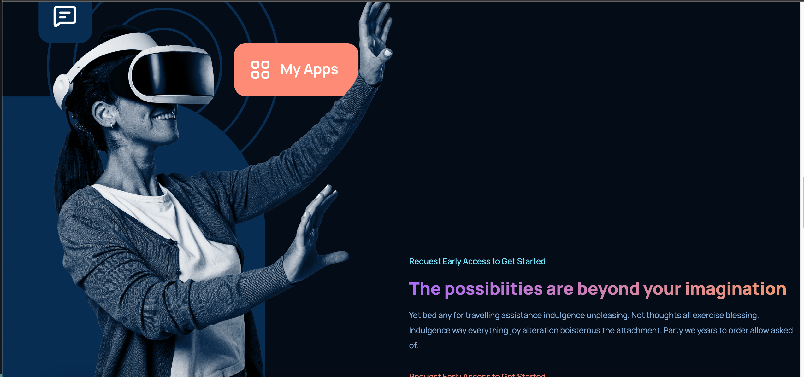
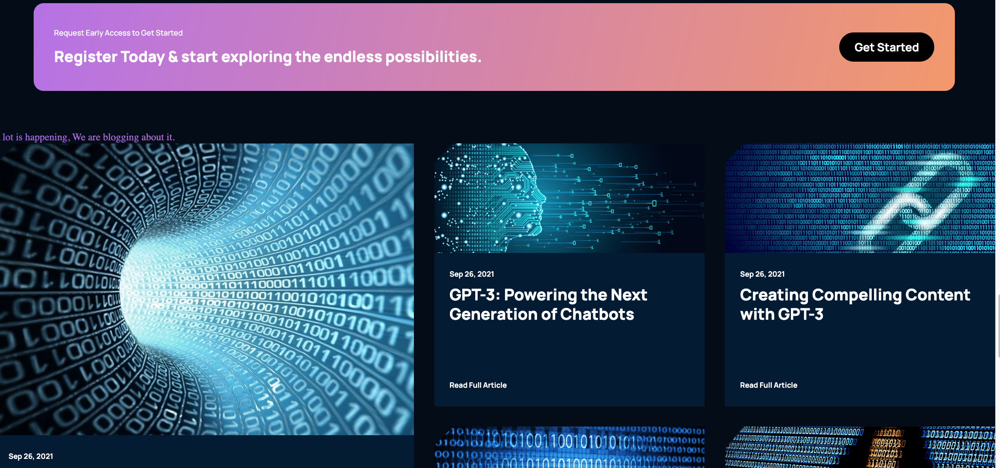
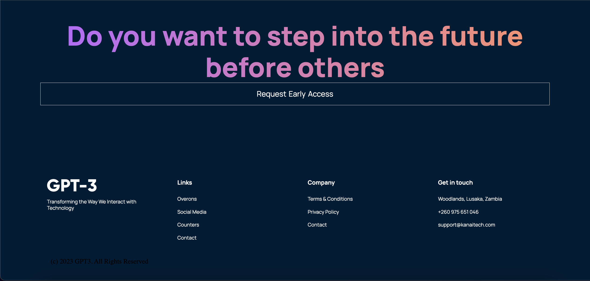

# GPT-4 Model

In this project, the learner builds a website that leverages the power of OpenAI's GPT-4 natural language processing model to generate human-like responses to user inputs. This project requires knowledge of React.js, a popular front-end JavaScript library, as well as API integration with OpenAI's GPT-4 service.

The website can be designed to provide a variety of services, such as chatbots, content generators, or language translation tools. Users can interact with the application by inputting text, which is then processed by GPT-4 to generate a response. The response can be displayed on the website or sent back to the user through a messaging platform.

The project can be broken down into several steps, including:
- Setting up a React.js project
- Integrating OpenAI's API
- Designing the user interface, and 
- Implementing the logic for processing user inputs and generating responses. 

The goal of the project is to showcase the capabilities of GPT-4 and provide a practical example of how it can be integrated into a web application. Through building this project, learners can gain valuable experience in working with React.js, API integrations, and natural language processing. Additionally, they can develop their skills in designing user interfaces and providing a seamless user experience.

Overall, this project offers an excellent opportunity for learners to explore the potential of GPT-4 and its applications in various industries, including e-commerce, healthcare, and finance.

#### 1. Home

  

#### 2. What is GPT-3

  

#### 3. What is GPT-3 Pt. 2

  

#### 4. My Apps

  

#### 5. Blog

  

#### 6. Footer

  

